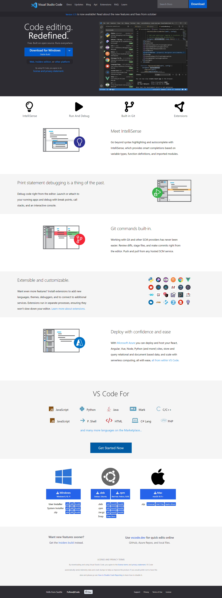

# Vs Code landing page

 

<!-- ### LIVE LINK -->

<!-- [Developer Landing page](https://ankush-landingpage.netlify.app/) -->

---

# Designed by : `Ankush Thakur`

### Technology Used

    - HTML
    - Tailwind

### Concept Learned

    - How to use Tailwind
    - Learned Responsive Classes in Tailwind
    - Learned Psuedo classes in Tailwind
    - Learned How to use attribute values in Tailwind

# SCREEN SHOT OF PROJECT

## Time Taken to Complete the Project

> 2.5 Days
